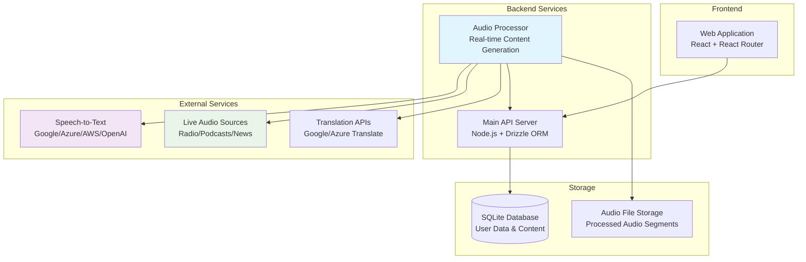
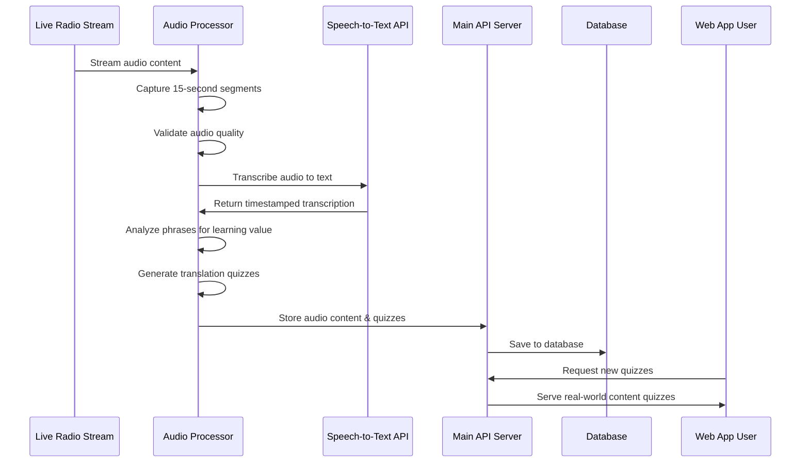

# Polyglottos

An open-source language learning platform designed to make acquiring new languages engaging and rewarding through daily practice and interactive quizzes. Inspired by Duolingo, this project aims to provide a fun and effective way to achieve fluency in various languages.

**What makes Polyglottos unique:** Unlike traditional language learning apps that rely on artificial or scripted content, Polyglottos captures and processes real-world audio from live sources (radio, podcasts, news) to create authentic learning materials that reflect how the language is actually spoken today.

## Features

### Core Learning Platform

- **User authentication and profiles** - Secure account management with personalized learning paths
- **Interactive quizzes** - Multiple choice, fill-in-the-blank, listening comprehension, and translation exercises
- **Lessons/Challenges** - Structured learning units composed of multiple quizzes with progressive difficulty
- **Progress tracking** - Comprehensive statistics on quizzes completed, lessons finished, and accuracy rates

### Real-World Audio Processing (Audio Processor Service)

- **Live audio capture** - Automatically captures audio segments from live radio streams, podcasts, and news sources
- **Speech-to-text transcription** - Converts audio to text using industry-leading STT services (Google Cloud, Azure, AWS, OpenAI)
- **Audio content validation** - Ensures captured audio contains meaningful content (not silent or just background noise)
- **Phrase analysis** - Identifies grammatically useful phrases and expressions suitable for language learning
- **Automatic translation** - Provides context-aware translations for learning phrases
- **Dynamic quiz generation** - Creates listening comprehension and translation quizzes from real-world content
- **Multi-format support** - Outputs audio in WAV or MP3 formats optimized for different use cases

### Planned Features
- **Gamification elements** - Points, leaderboards, streaks, and achievement badges
- **Expanded quiz types** - Image labeling, pronunciation practice, and conversation simulation
- **Adaptive difficulty** - AI-driven difficulty adjustment based on user performance
- **Advanced analytics** - Detailed progress statistics with topic-specific accuracy tracking
- **Community features** - User forums, shared resources, and collaborative learning
- **Mobile applications** - iOS and Android apps for learning on-the-go

## Architecture

Polyglottos consists of multiple services working together to provide a comprehensive language learning experience:

### System Architecture



### Data Flow



## Why Real-World Audio Content Matters

Traditional language learning apps often use artificial, scripted content that doesn't reflect how languages are actually spoken in real-world contexts. Polyglottos addresses this by:

### Authentic Language Exposure
- **Current vocabulary and expressions** - Learn words and phrases that are actually being used today
- **Natural speech patterns** - Experience real pronunciation, intonation, and speaking rhythm  
- **Cultural context** - Understand how language relates to current events and cultural topics
- **Varied speakers** - Exposure to different accents, ages, and speaking styles from radio personalities and news anchors

### Dynamic Content Generation
- **Always fresh material** - New quizzes generated daily from live audio streams
- **Topical relevance** - Learn vocabulary related to current news, weather, sports, and cultural events
- **Difficulty progression** - AI-powered phrase analysis ensures content matches learner levels
- **Multi-skill practice** - Listening comprehension and translation exercises from the same authentic source

### Supported Languages

Currently processing live audio content for:
- **Danish (da)** - DR Radio streams for immersive Nordic language learning
- **English (en)** - News and talk radio for advanced learners
- **Spanish (es)** - Latin American and European Spanish sources
- **Hindi (hi)** - Indian news and cultural programming

*Additional languages can be easily added by configuring new audio sources and language codes.*

## Getting Started

### Prerequisites
- Node.js 18+ and npm
- FFmpeg (for audio processing)
- At least one Speech-to-Text API key (Google Cloud, Azure, AWS, or OpenAI)

### Quick Start

1. **Clone the repository**
   ```bash
   git clone https://github.com/your-org/polyglottos.git
   cd polyglottos
   ```

2. **Start the main API server**
   ```bash
   cd apps/api
   npm install
   cp .env.example .env
   # Edit .env with your database configuration
   npm run dev
   ```

3. **Start the audio processor** (in a new terminal)
   ```bash
   cd apps/audio-processor
   npm install
   cp .env.example .env
   # Edit .env with your STT API keys
   npm run build
   npm start
   ```

4. **Launch the web application** (in a new terminal)
   ```bash
   cd apps/web
   npm install
   npm run dev
   ```

5. **Access the application**
   - Web app: http://localhost:5173
   - API server: http://localhost:8787
   - Audio processor: http://localhost:3001

### Configuration

The audio processor requires at least one STT service to be configured:

```bash
# In apps/audio-processor/.env
PROCESSING_INTERVAL_MINUTES=5  # How often to capture audio
AUDIO_FORMAT=wav              # Output format (wav or mp3)

# Configure at least one STT service:
GOOGLE_CLOUD_STT_API_KEY=your_key
GOOGLE_CLOUD_PROJECT_ID=your_project

# OR
OPENAI_API_KEY=your_openai_key
```

See the [Audio Processor README](apps/audio-processor/README.md) for detailed configuration options.

## Project Structure

```
polyglottos/
├── apps/
│   ├── api/                 # Main backend API server
│   ├── audio-processor/     # Real-time audio content generation
│   └── web/                # React frontend application
├── packages/               # Shared utilities and types
└── docs/                  # Documentation and guides
```

## Contributing

We welcome contributions from the open-source community! Please see our [CONTRIBUTING.md](CONTRIBUTING.md) file for guidelines on how to get involved.

## License

This project is licensed under the [Apache License](LICENSE).
