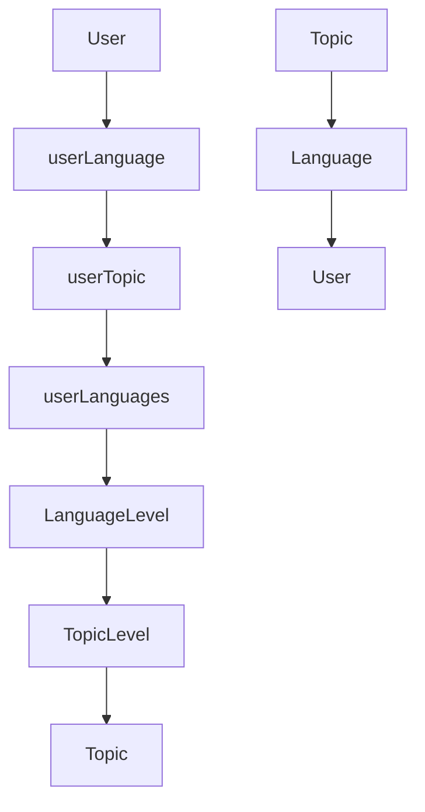

# Polyglottos

An open-source language learning platform designed to make acquiring new languages engaging and rewarding through daily practice and interactive quizzes. Inspired by Duolingo, this project aims to provide a fun and effective way to achieve fluency in various languages.

## Features

- **Core Features (Initial Release):**

  - User authentication and profiles
  - Interactive quizzes (multiple choice, fill-in-the-blank, etc.)
  - Lessons/Challenges composed of multiple quizzes
  - Basic progress tracking (quizzes completed, lessons finished)

- **Planned Features:**
  - Gamification elements (points, leaderboards, streaks)
  - Expanded quiz types (image labeling, audio recognition)
  - Difficulty levels for quizzes and lessons
  - More detailed progress statistics (accuracy by topic, rolling averages)
  - Community features (user forums, shared resources)

## Diagram

## Contributing

We welcome contributions from the open-source community! Please see our [CONTRIBUTING.md](CONTRIBUTING.md) file for guidelines on how to get involved.

## License

This project is licensed under the [Apache License](LICENSE).
